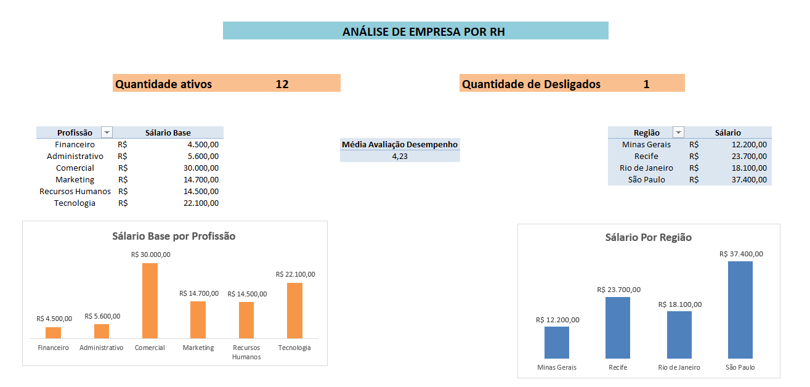
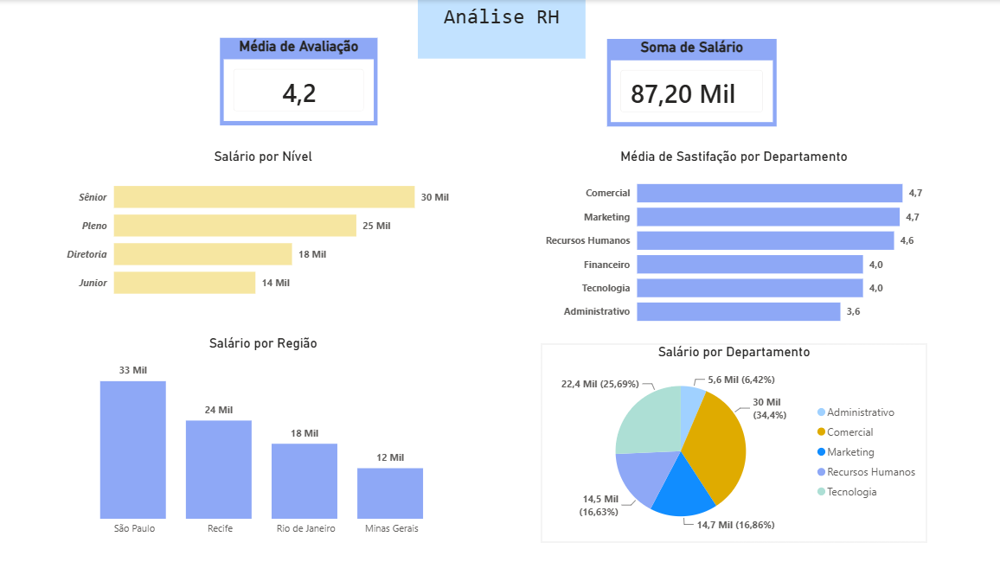

# Desafio de Excel — People Analytics

Projeto pessoal desenvolvido para praticar **Excel, tratamento de dados, tabelas dinâmicas, visualização e dashboards aplicados a Recursos Humanos**.

**Tema:** Gestão de Talentos e análise de indicadores de RH

## Objetivo

Transformar uma base de colaboradores em um relatório executivo de People Analytics. O desafio foi estruturado para exercitar desde a preparação dos dados até a apresentação de indicadores de headcount, remuneração, desempenho, satisfação e distribuição regional.

## Entregas do desafio

### Tratamento da base — aba `Dados_Colaboradores`

A etapa de preparação foi planejada para identificar e corrigir problemas intencionais na base:

- Remoção de cadastros duplicados a partir do ID do colaborador;
- Tratamento de salários nulos ou zerados com referência ao cargo ou à média aplicável;
- Padronização de departamentos com grafias diferentes e espaços extras;
- Normalização das datas de admissão;
- Conversão do intervalo final em uma Tabela do Excel, permitindo referências estruturadas e expansão automática.

### Indicadores estratégicos — aba `Dashboard`

O painel reúne indicadores de gestão de pessoas, como **headcount ativo**, **quantidade de desligados**, **folha salarial total**, **salário médio**, **tempo médio de casa** e **média de avaliação ou satisfação**.

### Análises visuais

Foram utilizadas visões cruzadas com diferentes tipos de gráficos para comparar:

- Salário-base por profissão ou departamento;
- Salário por nível hierárquico;
- Salário por região de trabalho;
- Média de avaliação ou satisfação por departamento;
- Distribuição da folha salarial por departamento;
- Quantidade de colaboradores por contrato, status ou região.

### Segmentação de dados

A proposta inclui segmentações para filtrar o relatório por **status**, **região** e **departamento**, facilitando a exploração da base por diferentes recortes de negócio.

### Automação com VBA

O arquivo `vba/limpar_filtros_atualizar.bas` contém uma macro de referência para limpar filtros das tabelas e atualizar o relatório. Ela pode ser associada a um botão na aba `Dashboard`.

## Dashboards desenvolvidos

### Análise de empresa por RH

Esta versão apresenta quantidade de colaboradores ativos, desligados, média de avaliação, salário-base por profissão e salário por região.



### Análise RH

Esta versão apresenta média de avaliação, soma de salários, salário por nível, média de satisfação por departamento, salário por região e participação salarial por departamento.



## Organização do projeto

```text
.
├── dashboard/
│   ├── dashboard_analise_empresa_rh.png
│   └── dashboard_analise_rh.png
├── data/                         # Espaço para a base de colaboradores
├── docs/
│   └── estrutura_abas.md
├── excel/                        # Espaço para o arquivo .xlsx final
├── vba/
│   └── limpar_filtros_atualizar.bas
├── .gitignore
└── README.md
```

## Como reproduzir no Excel

Primeiro, insira a base na aba `Dados_Colaboradores`. Remova duplicidades pelo ID e padronize textos e datas antes de criar a Tabela do Excel com `Ctrl + T`. Em seguida, construa as tabelas dinâmicas a partir dessa tabela, configure os KPIs na aba `Dashboard` e conecte as segmentações às tabelas dinâmicas.

Para habilitar a automação, abra o editor do VBA com `Alt + F11`, importe ou copie o conteúdo do arquivo `.bas`, insira um botão na aba `Dashboard` e associe a macro `LimparFiltrosEAtualizar`.

## Observações sobre os indicadores exibidos

Os dashboards anexados mostram, entre outros elementos, **12 colaboradores ativos**, **1 desligamento**, média de avaliação próxima de **4,2** e folha salarial total de aproximadamente **R$ 87,2 mil**. Os valores devem ser interpretados como os resultados da base utilizada no desafio e podem variar caso a base seja atualizada.

O arquivo original do Excel com a base de colaboradores não foi incluído nesta entrega. Por esse motivo, as pastas `data/` e `excel/` estão preparadas para receber a base e a pasta de trabalho final quando forem disponibilizadas.

## Aprendizados

Este desafio reforçou a importância de separar a qualidade dos dados da camada de apresentação. Um dashboard de RH só é confiável quando IDs, salários, departamentos, datas e status foram tratados antes da criação dos indicadores. A combinação de Tabelas do Excel, tabelas dinâmicas, segmentações e VBA também permite construir um relatório interativo e reutilizável sem depender de atualizações manuais repetitivas.

## Autor

**Leticyaani** — projeto pessoal de prática em Excel, dashboards e People Analytics.

